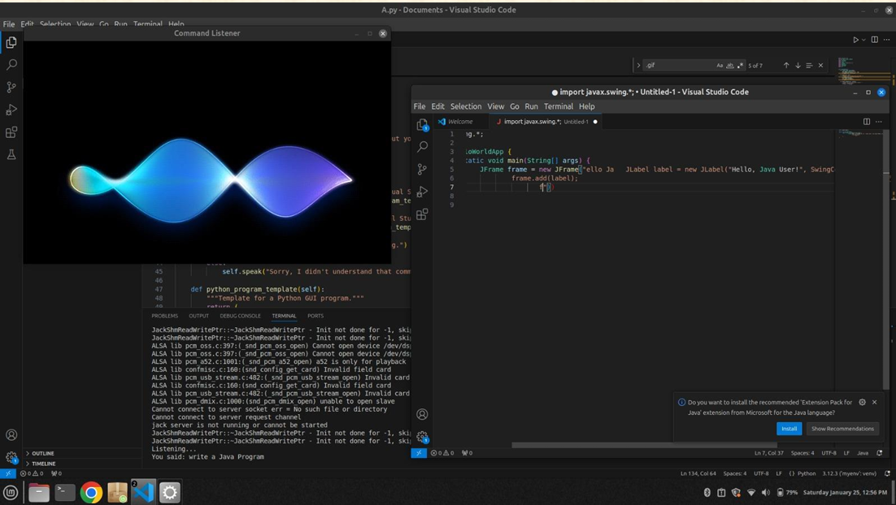
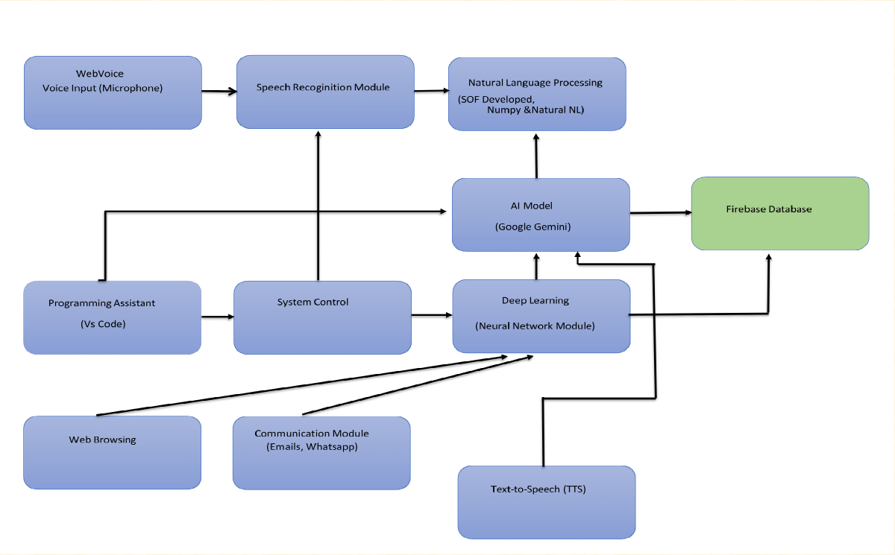

# 🎙️ NeuraVoice – AI Voice-Controlled PC Assistant

NeuraVoice is an AI-powered voice assistant designed to automate coding and system workflows using natural voice commands. It enables hands-free interaction with development tools, communication services, and system operations.

---

## 🖥️ GUI Preview



---

## 🚀 Features

- 🎤 Voice-controlled coding (create, edit, run code in VS Code)
- 🧠 AI-powered responses using LLM APIs
- 📧 Send emails using voice commands (SMTP)
- 💬 Send WhatsApp messages via Twilio API
- 📄 Generate documents and automate tasks
- ☁️ Real-time data handling with Firebase
- ⚡ Hands-free workflow automation

---

## 🔄 System Flow



---

## ⚙️ How It Works

1. User provides voice input  
2. Speech Recognition converts voice to text  
3. NLP processes the command  
4. System executes tasks (coding, messaging, automation)  
5. AI generates response/output  

---

## 🛠️ Tech Stack

- **Language:** Python  
- **AI:** NLP, Speech Recognition, OpenAI API  
- **Database:** Firebase  
- **Integration:** VS Code, SMTP, Twilio API  

---

## ▶️ How to Run

```bash
git clone https://github.com/yourusername/neuravoice
cd neuravoice
pip install -r requirements.txt
python main.py
